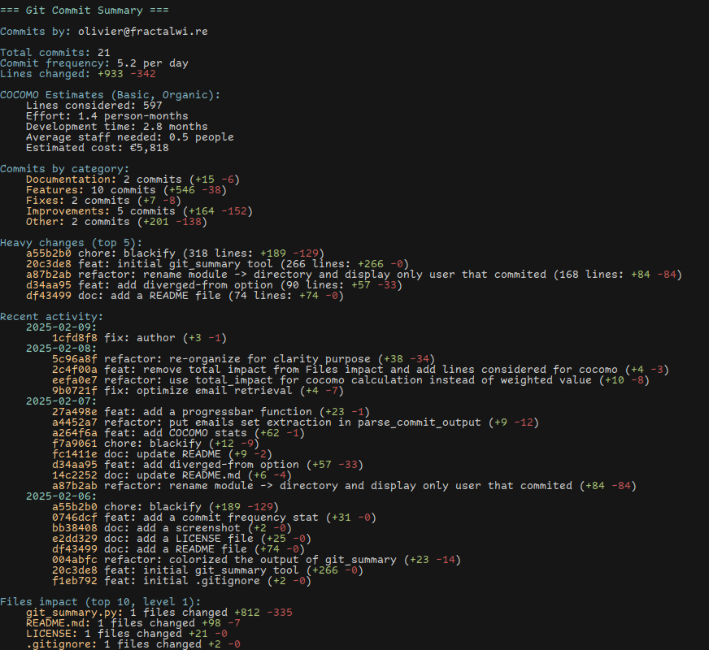

# Git Summary Tool

A command-line tool that generates comprehensive summaries of git repository activity.



## Features

- Filter commits by email address(es) or email pattern
- Analyze commits within specific time periods (days, weeks, months, years)
- Categorize commits (Features, Fixes, Improvements, etc.)
- Show heavy changes and recent activity
- Analyze impact on modules/directories
- Colorized output for better readability

## Installation

1. Clone this repository
2. Make the script executable:
```bash
chmod +x git_summary.py
```

## Usage

Basic usage:
```bash
./git_summary.py [options]
```

### Options

- `--emails`, `-e`: Filter commits by specific email addresses
- `--email-contains`, `-ec`: Filter commits by emails containing a string
- Time period options (mutually exclusive):
  - `--days`, `-d`: Show commits from last N days
  - `--weeks`, `-w`: Show commits from last N weeks
  - `--months`, `-m`: Show commits from last N months
  - `--years`, `-y`: Show commits from last N years
- `--module-level`, `-ml`: Directory level to consider as modules (default: 1)

### Examples

Show your commits from the last 30 days:
```bash
./git_summary.py --days 30
```

Show commits from specific email addresses:
```bash
./git_summary.py --emails user1@example.com user2@example.com
```

Show commits from the last 2 weeks for emails containing "company.com":
```bash
./git_summary.py --weeks 2 --email-contains company.com
```

Analyze modules at directory level 2:
```bash
./git_summary.py --module-level 2
```

## Output

The tool provides:
- Total commit count and lines changed
- Commits categorized by type (Features, Fixes, etc.)
- Top 5 commits with most changes
- Recent activity (last 5 dates with commits)
- Module impact analysis (if applicable)

## Requirements

- Python 3.6+
- Git repository

## License

This project is licensed under the MIT License - see the [LICENSE](LICENSE) file for details.
